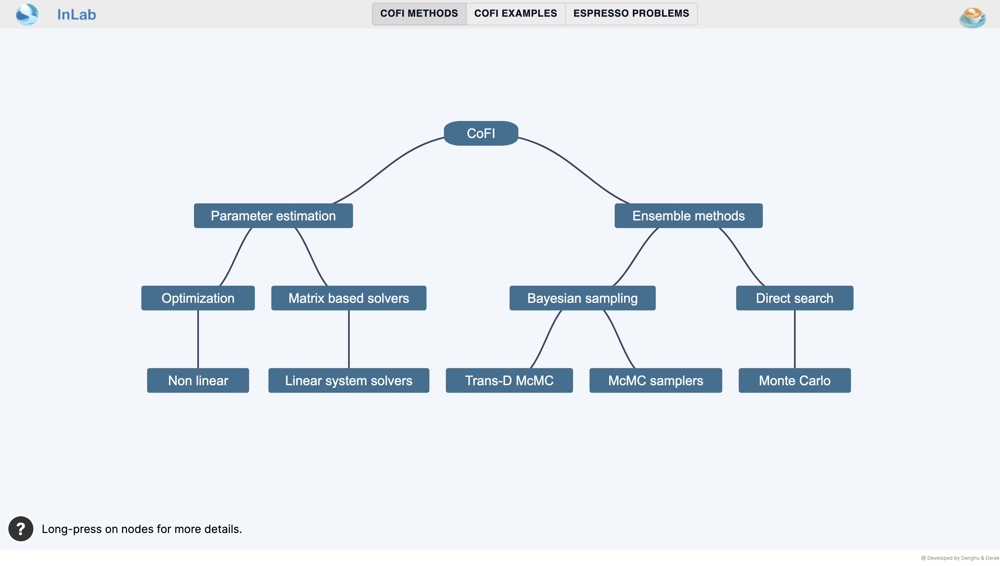

# InLab Explorer

Welcome to the [InLab Explorer](https://inlab.au/inlab-explorer) - explore the InLab software ecosystem interactively!

## Developer reference

This repository includes the frontend of InLab Explorer. This is a server-side rendered 
Next.js project and data are stored as three JSON files directly in the public folder:

- [public/method_relation.json](public/method_relation.json)
- [public/example_relation.json](public/example_relation.json)
- [public/app_relation.json](public/app_relation.json)

These files are created by 
[a workflow from the backend](https://github.com/inlab-geo/inlab-explorer-backend/actions/workflows/jobs.yaml), 
which is triggered whenever there's a change to the cofi, espresso and cofi-examples repositories.

### Serve locally

If you'd like to run this app locally:

1. Clone this repository: `git clone https://github.com/inlab-geo/inlab-explorer.git; cd inlab-explorer`
2. Install JavaScript dependencies: `npm install`
3. Run the app in development mode: `npm run dev`
4. Open [http://localhost:3000](http://localhost:3000) with your browser to see the website

### Change colour schemes

Two file are related to changing colour themes:

- Colour set for selection bar: [src/components/topPanel/style.tsx](src/components/TopPanel/style.tsx)
- Colour set for the tree and background canva: [src/components/Rectangle/style.tsx](src/components/Tree/style.tsx)

### Update the data

The three data files sitting under `public` folder are updated automatically by the 
[backend workflow](https://github.com/inlab-geo/inlab-explorer-backend/actions/workflows/jobs.yaml).

Follow the instructions in the backend repository for how to generate the files manually.
